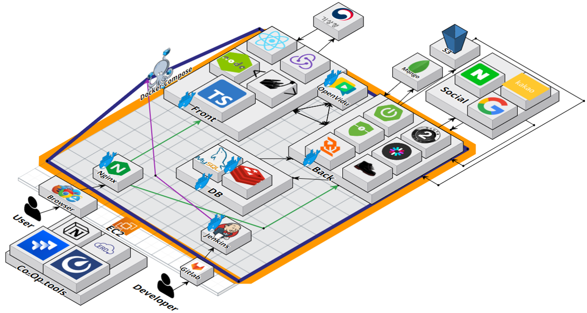
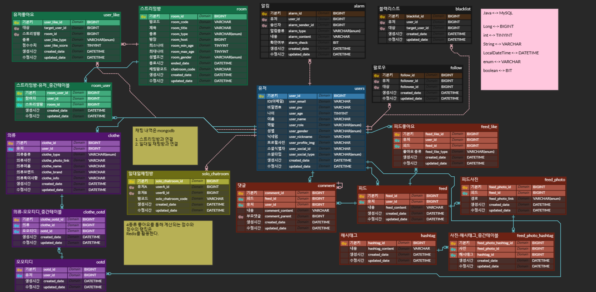

# How Do I Look

## 🖥️ 프로젝트 소개

### 개요

- 한줄 소개 : WebRTC 화상 채팅을 이용한 코디 조언 서비스
- 서비스 명 : **`HOW Do I Look`**

### 타겟 🎯

- 옷을 잘 못입지 못해 다른 사람들에게 조언을 구하고 싶은 사람들
- 자신의 패션 철학을 공유하고 옷과 관련된 소통을 진행해보고 싶은 사람들

  👉  **옷에 관심을 가지고있는 모든 사람들** 

 

## 👗기획 배경

### 목적

- 옷에 관심이 있는 사람들이 소통할 수 있는 커뮤니티의 장 마련

### 기대효과

- 기존의 옷을 고르고 입는데에 고민을 가진 사람들이 실시간으로 조언을 받을 수 있어 상황별로 맞춤 옷을 선정하는데에 도움을 받음
- 옷에 관심이 많은 사람들은 다른 사람들에게 조언을 하며 재미를 느끼고 배찌를 얻기 위해 적극적으로 사이트를 이용함으로써 양질의 조언을 받을 수 있는 사람들이 늘어남
- 패션에 관심이 많은 사람들이 모인 사이트이므로 유저들이 올린 피드를 통해 다양한 옷에 대한 정보 수집가능
- 자신의 옷을 온라인으로 간편하게 코디 혹은 관리 가능

 

## 🕰️ 개발 기간
* 2023.07.04일 - 2023.08.18일

## 🧑‍🤝‍🧑 맴버구성
<table style="text-align: center;">
  <tr>
    <th>김은서</th>
    <th>박세윤</th>
    <th>손정민</th>
    <th>신산하</th>
    <th>유태영</th>
    <th>정형준</th>
  </tr>
  <tr>
    <td></td>
    <td></td>
    <td></td>
    <td></td>
    <td></td>
    <td></td>
  </tr>
  <tr>
    <td>Back</td>
    <td>Back & Infra</td>
    <td>Front</td>
    <td>Front</td>
    <td>Back</td>
    <td>Back</td>
  </tr>
  <tr>
    <td>- 옷장, 스트리밍, 이미지 관련 API 
        - 이미지 배경제거 
        - 프론트 메인페이지</td>
    <td>- 역할 뭐했낭ㅇㅇ</td>
    <td>- 오픈비두 
        - 페이지네이션, 검색 구현 
        - 로그인</td>
    <td>- 프로토타입 제작 및 디자인 (Figma) 
        - 컴포넌트 구성 및 API 기능 적용 (Live/Feed/Mypage/옷장/채팅/랭킹) 
        - 웹 소켓 통신을 이용한 채팅(1:1 / M:N) / 방입장 / 방퇴장 / 블랙리스트 구현 
        - 기상청 API를 활용한 OOTD 서비스 제작</td>
    <td>- 피드, 댓글, 블랙리스트, 팔로우 API 
        - UCC 총 감독, 주연배우</td>
    <td>- 웹 소켓 프로토콜 관련 기능 
        - 채팅 API 
        - 발표</td>
  </tr>
</table>

 

## ⚒️ 개발 환경
- Front
- Back
    - **Type** : Gradle - Groovy
    - `Java 11`
    - **IDE** : IntelliJ IDEA
    - **Framework** : Springboot(2.7.14)
    - **Database** : MySql(8.0.33)
    - **ORM** : JPA

## ⚙️ 프로젝트 구조

 

## 📌 주요 기능

회원관리

- 로그인
- 회원가입

마이페이지

- 팔로워, 팔로잉 관리
- 내 피드 관리
- 좋아요 관리
- 배찌 관리
- 블랙리스트 관리

옷장 관리 서비스

- 옷 저장, 수정, 삭제, 분류
- 옷 사진 저장 시 해당 이미지 배경 제거
- 저장한 옷 이미지들을 이용한 코디
- 기상청 API 를 이용한 현재 날씨 공유

커뮤니티 서비스

- 피드 저장, 수정, 삭제 
- 해시태그를 통한 검색
- 4가지 종류의 좋아요 운영
- 댓글

스트리밍 서비스

- 방 생성, 수정, 삭제, 입장
- WebSocket, Stomp, SockJS 프로토콜을 이용한 그룹 채팅 ( 문자열 채팅 및 이미지 채팅)
- 레디스의 메시지큐를 사용하여 부하분산
- 이미지 검색 및 옷 데이터 읽기
- 강퇴, 블랙리스트, 점수 부여
- WebRTC를 이용한 화상회의

랭킹 서비스

- 피드 좋아요, 스트리밍을 통해 부여받은 점수를 취합한 4가지 종류의 랭킹
- 각 랭킹의 상위 10% 배찌 부여

#### 채팅 서비스

 

## 🎁 설계 산출물
### 요구사항 정의서
- [요구사항 정의서](https://docs.google.com/spreadsheets/d/1NvqENkNIhlGdF_9zhgCSmFZBL0I4IAqds_iyspejK20/edit#gid=1465296996)
### figma
- [figma](https://www.figma.com/file/3BwC0XBTPb3MhTY9zYYa6F/Prototype?type=design&node-id=95-1536&mode=design&t=d6VnqvyfoMQECuEa-0)
### ERD 설계

### API 명세서
- [API 명세서](https://triangular-printer-aad.notion.site/API-cf99cb16a24b4f989c4d2616c88523fe)
### 협업 관리
- 노션 : [바로가기](https://triangular-printer-aad.notion.site/4-6fa2c73aa08843f9a23e61d548609074)
- 지라 : private
- 코드 컨벤션 : [바로가기](https://triangular-printer-aad.notion.site/4-6fa2c73aa08843f9a23e61d548609074)

## 👀 시연영상
### 메인페이지
### 피드
### 채팅
### 옷장