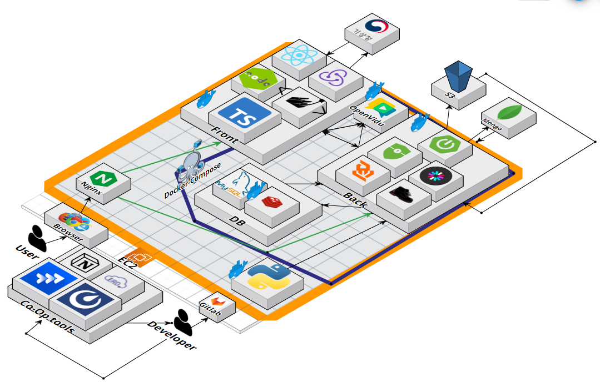

# How Do I Look

 

## 🖥️ 프로젝트 소개

 

### 개요

- 한줄 소개 : WebRTC 화상 채팅을 이용한 코디 조언 서비스
- 서비스 명 : **`HOW Do I Look`**

 

### 🎯 타겟

- 옷을 잘 못입지 못해 다른 사람들에게 조언을 구하고 싶은 사람들
- 자신의 패션 철학을 공유하고 옷과 관련된 소통을 진행해보고 싶은 사람들

  

## 👗 기획 배경

 

### 목적

- 옷에 관심이 있는 사람들이 소통할 수 있는 커뮤니티의 장 마련

 

### 기대효과

- 기존의 옷을 고르고 입는데에 고민을 가진 사람들이 실시간으로 조언을 받을 수 있어 상황별로 맞춤 옷을 선정하는데에 도움을 받음
- 옷에 관심이 많은 사람들은 다른 사람들에게 조언을 하며 재미를 느끼고 뱃지를 얻기 위해 적극적으로 사이트를 이용함으로써 양질의 조언을 받을 수 있는 사람들이 늘어남
- 패션에 관심이 많은 사람들이 모인 사이트이므로 유저들이 올린 피드를 통해 다양한 옷에 대한 정보 수집가능
- 자신의 옷을 온라인으로 간편하게 코디 혹은 관리 가능

  

## 🕰️ 개발 기간
* 2023.07.04일 - 2023.08.18일 (약 7주)

  

## 🧑‍🤝‍🧑 멤버구성
<table style="text-align: center;">
  <tr>
    <th>신산하</th>
    <th>박세윤</th>
    <th>손정민</th>
  </tr>
  <tr>
    <td></td>
    <td></td>
    <td></td>
  </tr>
  <tr>
    <td>Team Leader / Front</td>
    <td>Back / Infra / Front</td>
    <td>Front</td>
  </tr>
  <tr>
    <td>
    - 프로토타입 제작 및 디자인 (Figma) 
    - 컴포넌트 구성 및 API 기능 적용 (Live/Feed/Mypage/옷장/채팅/랭킹) 
    - 웹 소켓 통신을 이용한 채팅(1:1 / M:N) / 방입장 / 방퇴장 / 블랙리스트 구현 
    - 기상청 API를 활용한 OOTD 서비스 제작 
    </td>
    <td>
    - (Infra) Docker를 활용한 프로젝트 수동 배포 
    - (Back) Spring Security를 활용한 인증 / 인가 (JWT 토큰 방식) 
    - (Back) Redis를 활용한 실시간 Ranking 서비스 
    - (Back) Scheduler를 활용하여 일정 주기별 특정 서비스 제공 
    - (Back) User, Ranking, Badge 기반 Backend API 
    - (Front) 마이페이지, 랭킹 페이지 구현 
    - (Front) 팔로우 기반 서비스 구현 
    </td>
    <td>
    - 오픈비두 Api를 활용한 화상회의 컴포넌트 구현(카메라, 오디오 설정 포함) 
    - 페이지네이션 구현, 검색 구현(동기화를 이용한 실시간 목록 갱신 방식) 
    - 로그인 컴포넌트 및 API 적용 
    </td>
  </tr>
</table>

<table style="text-align: center;">
  <tr>
    <th>김은서</th>
    <th>유태영</th>
    <th>정형준</th>
  </tr>
  <tr>
    <td></td>
    <td></td>
    <td></td>
  </tr>
  <tr>
    <td>Back</td>
    <td>Back</td>
    <td>Back</td>
  </tr>
  <tr>
    <td>- 옷장, 스트리밍, 이미지 관련 API 
        - 이미지 배경제거 
        - 프론트 메인페이지</td>
    <td>- 피드, 댓글, 블랙리스트, 팔로우 API 
        - UCC 총 감독, 주연배우</td>
    <td>- 웹 소켓 프로토콜 관련 기능 
        - 채팅 API 
        - 발표</td>
  </tr>
</table>

  

## ⚒️ 개발 환경

- Co-Op Tools
  
  - Notion
  - Mattermost
  - Discord

 

- Front
  
  - IDE : Visual Studio Code
  - React.js
  - Redux Toolkit
  - TypeScript
  - Styled-Components

 

- Back
  
  - IDE : IntelliJ
  - SpringBoot
  - Spring Security
  - WebSocket
  - Stomp

 

- DB
  
  - MySQL
  - Redis
  - MongoDB

 

- Infra
  
  - SSH Tool : MobaXterm
  - AWS EC2
  - Docker
  - Nginx
  - AWS S3

  

## ⚙️ 프로젝트 구조

  

## 🎁 설계 산출물

### 요구사항 정의서
- [요구사항 정의서](https://docs.google.com/spreadsheets/d/1NvqENkNIhlGdF_9zhgCSmFZBL0I4IAqds_iyspejK20/edit#gid=1465296996)

 

### figma
- [figma](https://www.figma.com/file/3BwC0XBTPb3MhTY9zYYa6F/Prototype?type=design&node-id=95-1536&mode=design&t=d6VnqvyfoMQECuEa-0)

 

### ERD 설계

 

### API 명세서
- [API 명세서](https://triangular-printer-aad.notion.site/API-cf99cb16a24b4f989c4d2616c88523fe)

 

### 협업 관리
- 노션 : [바로가기](https://triangular-printer-aad.notion.site/4-6fa2c73aa08843f9a23e61d548609074)
- 지라 : private
- 코드 컨벤션 : [바로가기](https://triangular-printer-aad.notion.site/4-6fa2c73aa08843f9a23e61d548609074)

  

## 👀 시연

 

### 📌 메인 페이지 / 로그인

https://github.com/SahhaShin/HOW-DO-I-LOOK/assets/33896511/4d84b7e5-df95-410c-ad98-ff18d9720866

- 저희 서비스의 핵심 기능들을 소개하는 메인 페이지입니다.

- 각 기능들을 스크롤을 통해 아래로 내리면 간단하게 확인할 수 있습니다.

- **회원가입 / 로그인 / 로그아웃**

 

### 📌 나만의 옷장

https://github.com/SahhaShin/HOW-DO-I-LOOK/assets/33896511/530dc70d-9f7a-4326-80c1-b3d15fe2c604

 - 나만의 옷장에 내가 가진 의류를 간단한 설명과 카테고리 분류와 함께 **등록**합니다.
  
 - 의류 등록 시, 의류 외 배경이 있는 사진이더라도, **누끼**를 자동으로 따서 옷장에 흰 배경의 깔끔한 사진이 업로드 됩니다.
  
 - 타 유저의 옷장에도 접속할 수 있습니다.
 	
    - **블랙리스트**에 등록되어 있거나, 옷장 접근 권한을 **PRIVATE**으로 제한한 경우에는 접속할 수 없습니다.
  
 

### 📌 OOTD(나만의 코디)

https://github.com/SahhaShin/HOW-DO-I-LOOK/assets/33896511/a922a661-edf2-416c-b423-5018179b8b3d

- 옷장에 등록한 옷들 중, **자주 입는 코디 조합을 저장**해 놓고 언제든지 확인할 수 있습니다.

- 현재 **날씨**를 통해 어떤 의류를 선택할 지 도움을 받을 수 있습니다.

 

### 📌 피드

https://github.com/SahhaShin/HOW-DO-I-LOOK/assets/33896511/854950a2-227c-43d7-bfa4-5068120061f3

- 피드에 나만의 패션을 **등록**할 수 있습니다.

- 각 피드는 여러 **사진**으로 이루어져 있으며, 각 사진은 여러 **해시태그**로 이루어져 있습니다.

- 각 피드의 작성자를 **팔로우 / 언팔로우** 할 수 있습니다.

- 다른 사람의 피드를 보며 **댓글**을 작성하거나, 네 가지 종류의 **좋아요**를 누를 수 있습니다.

- 최상단의 해시태그 **검색** 기능을 통해 특정 해시태그를 표시한 피드 글을 검색할 수 있습니다.

- 검색 창 하단의 **ALL / FOLLOWING / MY** 탭을 통해, 내가 원하는 종류의 피드만 볼 수 있습니다.

- 우측 **팔로우 탭**을 통해 현재 내가 팔로우 중인 유저의 정보를 알 수 있고, 해당 유저의 옷장 / 프로필로 이동할 수 있습니다.
	
    - 만약 해당 유저의 **블랙리스트** 명단에 올랐거나, 해당 유저가 옷장 / 프로필 공개를 **PRIVATE**로 설정했다면, 볼 수 없습니다.

 

### 📌 프로필

https://github.com/SahhaShin/HOW-DO-I-LOOK/assets/33896511/bd6a414e-365c-4766-b220-4d5002cb71a4

- 정보를 수정하는 등의 행위는 내 프로필에서만 이루어집니다. 타인의 프로필에서는 ReadOnly 상태입니다.

- **프로필 사진**을 업로드 / 수정할 수 있습니다. 

- **개인정보**를 확인 할 수 있고, 수정할 수 있습니다.

- **팔로잉 / 팔로워 / 피드 수**를 확인 할 수 있습니다.
	
    - 팔로잉 숫자를 클릭하면 **팔로잉 리스트**를 확인할 수 있습니다.
    - 팔로워 숫자를 클릭하면 **팔로워 리스트**를 확인할 수 있습니다.
    - 피드 숫자를 클릭하면 해당 프로필 유저가 등록한 피드의 **썸네일**을 확인할 수 있습니다.
    	
        - 해당 썸네일 클릭 시, 해당 피드의 상세 모달이 떠서, **댓글**을 작성하거나 네 가지 종류의 **좋아요**를 누를 수 있습니다.
       
- 등록한 **블랙리스트**를 확인할 수 있습니다.

- 내가 보유한 **뱃지**를 확인할 수 있습니다.

- 내가 보유한 뱃지 중, **대표 뱃지**를 설정할 수 있습니다.
	
    - 대표 뱃지로 선정하면, 스트리밍 방에서 해당 뱃지 **색**으로 표시가 되는 등의 이점이 있습니다.

 

### 📌 랭킹

https://github.com/SahhaShin/HOW-DO-I-LOOK/assets/33896511/90a7111f-c5e4-4ece-b494-170d1e305877

- 네 가지 좋아요 종류 별 점수 **랭킹**을 확인할 수 있습니다.
	
    - 랭킹은 **실시간** 반영됩니다.
    
- 실시간 반영되는 랭킹과 점수를 활용하여 매일 12시에 상위 10%에 한해서 **뱃지**를 제공합니다.

 

### 📌 스트리밍 방 만들기

https://github.com/SahhaShin/HOW-DO-I-LOOK/assets/33896511/49898216-c46b-4798-84b9-51ad2f26b8db

- 스트리밍 리스트 페이지에서 스트리밍 방을 **생성**할 수 있습니다. 
	
    - 해당 스트리밍 방에 **입장 조건**을 제한할 수 있습니다.
    
- 현재 예시는 **카메라** 끄기 버튼을 누른 상태로, 실제는 카메라에 비치는 화면이 나타납니다.
	
    - **마이크**도 끄고 킬 수 있습니다.

- 좌측에는 다섯가지 탭이 존재합니다.
	
    - 첫번째 탭은 현재 **내 옷장의 의류 사진**들을 보여줍니다. 내 옷장의 의류 사진들을 Pick할 수 있습니다.
    - 두번째 탭은 저희 서비스의 모든 **피드** 사진을 해시태그로 검색하고, 검색한 피드 사진들을 Pick 할 수 있습니다.  
    - 세번째 탭은 내가 **Pick했던 의류들**이 바구니 형태로 모여있습니다. 
    - 해당 바구니에서 내가 Pick했던 의류들의 **순서**를 **Drag & Drop** 방식으로 조정할 수 있습니다. 
    - 해당 바구니 하단의 전송 버튼을 통해 채팅방에 내가 정했던 순서대로 Pick한 사진들을 **입력**할 수 있습니다.
    - 네번째 탭은 현재 방의 정보입니다. 현재 방의 기본 정보 / 입장 조건 등이 적혀 있습니다.
    - 다섯번째 탭은 나가기 버튼입니다. 만약 방장이 나가기 버튼을 클릭 할 시 모든 인원이 방에서 나가게 되며, 해당 방은 스트리밍 리스트에서 사라집니다.

- 스트리밍 방에 입장하면 하단에 조그만한 **프로필**이 나타납니다.
	
    - 하단 프로필의 이름의 색은 프로필에서 선택한 **대표 뱃지의 색**입니다.
    - 하단 프로필을 클릭하면 여러 기능이 존재합니다.
    - **옷장 보기 기능** : 해당 참여자의 옷장을 볼 수 있습니다. 마찬가지로 해당 옷장의 의류를 Pick 할 수 있습니다.
    - **점수 주기 기능** : 해당 참여자가 만족스럽다면, 네 가지 종류의 좋아요를 -5~5점 제공할 수 있습니다.
    - 해당 참여자를 **팔로우 / 블랙리스트 등록 / 강퇴**할 수 있습니다.
    	
        - 만약 블랙리스트에 등록하면 해당 유저는 **즉시 강퇴**되고, 해당 유저의 스트리밍 리스트에 방이 사라지게 되어 **다시 접속할 수 없습니다.**
        - 강퇴 버튼은 **다시 접속**할 수 있습니다.
        
- 우측의 **채팅** 탭을 통해 자유롭게 소통할 수 있습니다. (음성으로도 자유롭게 소통 가능합니다.)
	
    - **닉네임의 색이 대표뱃지에 따라 변합니다.**
    - **사진**을 채팅에 올릴 수 있습니다.
    
 

### 📌 강퇴하고 스트리밍 종료하기 (스트리밍 생성자 시점)

https://github.com/SahhaShin/HOW-DO-I-LOOK/assets/33896511/f22ee723-57dd-4c45-ac51-a04fb2f2b396

 

### 📌 강퇴당하기 (스트리밍 참여자 시점)

https://github.com/SahhaShin/HOW-DO-I-LOOK/assets/33896511/33841069-08a0-4b64-9805-788127cc815b

  
